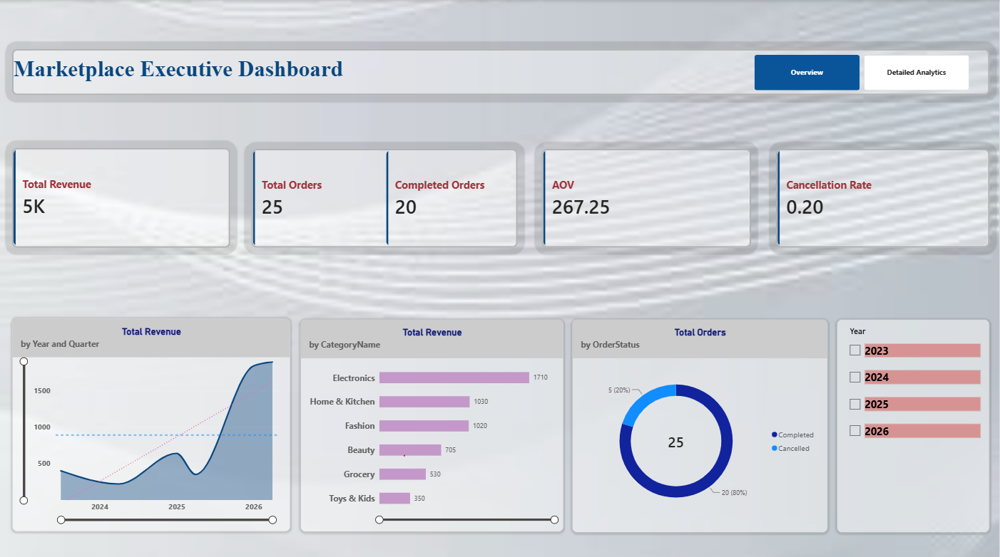
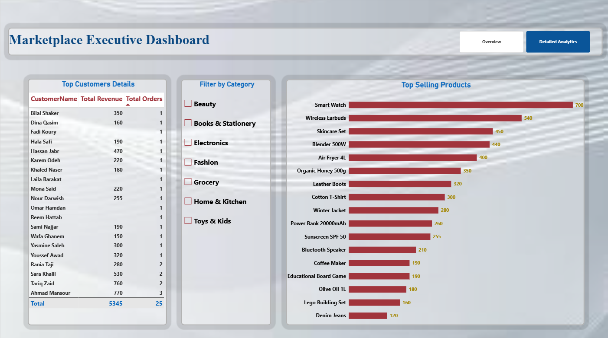

# 📊 Marketplace Executive Dashboard — Power BI

A high-end, executive-grade Power BI dashboard designed to provide seamless monitoring of marketplace operations and sales metrics. Built with a modern **Glassmorphism UI/UX** aesthetic (transparency, rounded corners, and smooth blur effects) across a structured two-page interface.

---

## 🖼️ Dashboard Preview

| Executive Overview | Detailed Analytics |
| :---: | :---: |
|  |  |

---

## 🎥 Interactive Demo

---

## 🚀 Key Features

* **Glassmorphism Visual Styling:** 40% transparency, 10px rounded visual borders, dark tech-gray background, and cohesive typography.
* **Two-Page Dynamic Navigation:** Built-in **Page Navigator** enabling 1-click seamless transitions between summary and granular views.
* **Executive Metrics (KPI Cards):** Instant tracking for **Total Revenue**, **Total Orders**, **Completed Orders**, **AOV (Average Order Value)**, and **Cancellation Rate**.
* **Interactive Filtering:** Global Year Slicer and Category Slicers for deep-dive analysis.

---

## 📑 Pages Breakdown

### 1. Executive Overview
Designed for C-level executives to evaluate high-level business health at a glance:
* **KPI Cards:** Overview of key performance indicators.
* **Revenue Trend:** Area chart mapping revenue progression over time.
* **Category Breakdown:** Bar chart displaying sales across categories.
* **Order Status:** Donut chart evaluating completion vs. cancellation proportions.

### 2. Detailed Analytics
Focused on operational insights and granular drill-downs:
* **Top Customers Table:** Detailed list of top-performing customers by revenue and order count.
* **Category Slicer:** Quick selection to filter granular table and chart visuals simultaneously.
* **Top Selling Products:** Horizontal bar chart highlighting top-ranked products with direct data labels.

---

## 🛠️ Data Architecture & Tech Stack

* **Tool:** Power BI Desktop
* **Data Modeling:** Star Schema architecture connecting core tables (`Orders`, `Dim_Date`, `Customers`, `Order_Items`, `Categories`, `Deliveries`).
* **ETL:** Power Query for data cleansing, value distribution, and date field formatting across 2024–2026.
* **DAX Measures:** Custom calculations for core business KPIs.

---

## 📂 Project Setup & How to Use

1. Clone or download this repository.
2. Open `Marketplace_Executive_Dashboard.pbix` in **Power BI Desktop**.
3. Hold **`Ctrl`** and click the **Page Navigator** buttons at the top right to switch between views.
